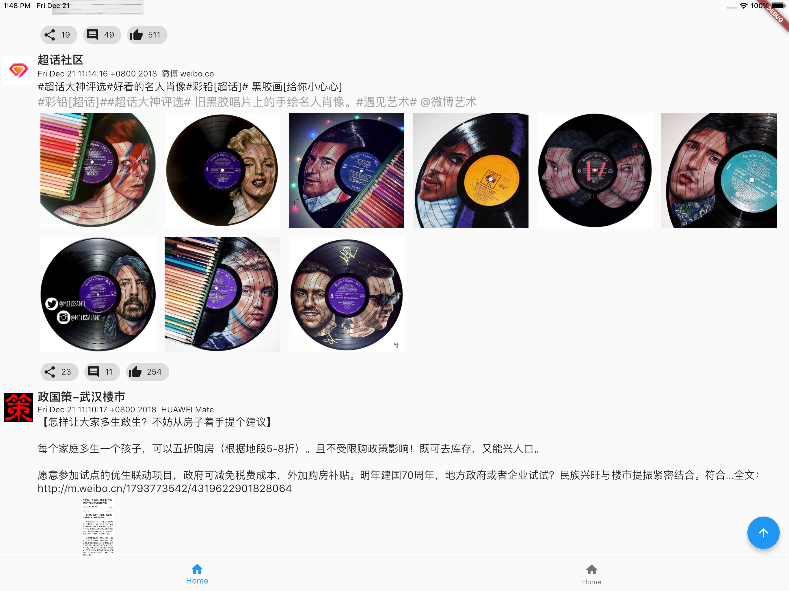
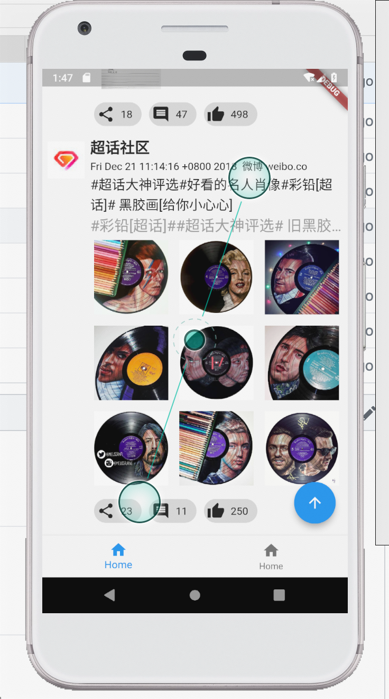

# easy_weibo

A new Flutter project.个人小练之开源新浪微博
[开源API地址](https://open.weibo.com/?display=0&retcode=6102)

# 1 OAuth授权

授权采用webview加载方式来实现code获取,大家可以根据自己的需要来进行替换内部id和secret

# 2 认知

    2.1 flutter学习更进一步
        通过这个过程巩固了flutter之中的概念和对一些内部认知更加的清晰
    2.2 OAuth
        在看新浪接入授权过程中重新认知了OAuth认证的过程，从之前的简单的调用到现在的去查看时序图
        是一个整体的提升的过程
    2.3 双端整合
        之前自己在公司Android项目中小范围使用过React Native，但是随之Android的项目流产也就放弃了Android
        的学习（需求才是第一动力），Android端的OAuth是拖拉好久才开始接入的，一开始是想着只要高通了
        Android授权很快搞定，今天终于鼓起勇气把Android搞定，这个也再次印证了Flutter的跨平台优势
        
        
# 目前简易效果

    iOS
    
    
    Android
    

## Getting Started

This project is a starting point for a Flutter application.

A few resources to get you started if this is your first Flutter project:

- [Lab: Write your first Flutter app](https://flutter.io/docs/get-started/codelab)
- [Cookbook: Useful Flutter samples](https://flutter.io/docs/cookbook)

For help getting started with Flutter, view our 
[online documentation](https://flutter.io/docs), which offers tutorials, 
samples, guidance on mobile development, and a full API reference.
